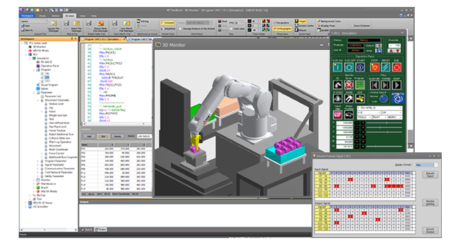
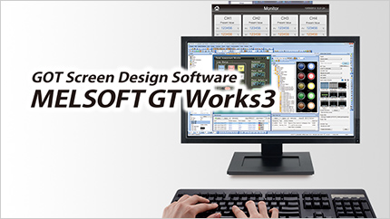

# MELFA ROS2 iQ Platform
_**Technology Convergence of Open Source and Factory Automation**_

## 1. Overview

This package connects **MELFA ROS 2**  with other Mitsubishi Electric's FA products via [Mitsubishi Electric’s iQ Platform](https://www.mitsubishielectric.com/fa/sols/efactory/iq/index.html), enabling both flexible development and industrial-level control.

We demonstrate:

- Controlling Robot Controller's GPIOs via Mitsubishi Electric HMI (Human Machine Interfaces)
- Reflecting ROS 2 messages on HMI (lights, indicators)

## 2. Why Use This Package?

-  ROS 2 is powerful but lacks hard real-time guarantees and safety certification
-  Mitsubishi Electric PLCs and HMIs offer industrial-grade reliability and control
-  This package merges both worlds for safer, flexible, and scalable robot control

---
## 3. Usage and Installation

### 3.1  What You Will Need

- A **Linux PC** with ROS 2 installed

- A **Windows PC** with **MELSOFT** software (RT Toolbox3, GX Works3, GT Works3)

> ℹ️ This repository has been tested on **Ubuntu 22.04 with ROS 2 Humble** and **Windows 10/11** with [MELSOFT](#34-melsofts) simulators.

### ✅ Tested Software Versions

| Component             | Version     |
|-----------------------|-------------|
| MELFA ROS2 Driver     | `v1.1.0`    |
| RT Toolbox3           | `v2.51D`    |
| GX Works3             | `v1.105K`   |
| GT Works3             | `v1.320J`   |

---

### 3.2  Installation & Setup

1.  Follow the [**MELFA ROS 2 & MELSOFT Setup Guide**](./doc/melsoft_setup.md)

    Install necessary ROS 2 packages and configure MELSOFT simulators on your Windows PC.

2. Go through the [**Tutorial Guide**](./doc/melfa_iq_tutorial.md)

    Step-by-step exercises for ROS 2 and iQ Platform integration.

---

### 3.3 Additional Resources

- [**MELSEC & iQ Platform Overview**](./doc/melsec_info.md)

    Learn how MELFA ROS 2 integrates with Mitsubishi Electric’s PLC controllers.

- [**GOT-HMI Overview**](./doc/got_info.md)

    Learn how to connect and control Mitsubishi Electric HMIs from ROS 2.

### 3.4 MELSOFTs

MELSOFT is a collection of Mitsubishi Electric engineering software products. In this package, we will use each MELSOFT's simulation tool to achieve our goal.

- [Learn more about MELSOFT](https://www.mitsubishielectric.com/fa/products/index.html#section_software)

Click on the images below to learn more!

##### MELSOFT RT Toolbox3 (MELFA Robot)

##### MELSOFT GT Works3 (GOT-HMI)

##### MELSOFT GX Works3 (MELSEC Controllers)

## 4. About Mitsubishi Electric Factory Automation

Mitsubishi Electric provides a comprehensive portfolio of advanced industrial automation solutions designed to meet the growing demands for precision, efficiency, and reliability in modern manufacturing.

Our integrated systems include:
- Programmable Logic Controllers (PLCs)
- Servo systems
- Human-Machine Interfaces (HMIs)
- Industrial robots
- Computerized Numerical Controllers (CNCs)
- Industrial networking and control platforms

These technologies empower manufacturers worldwide to build scalable, high-performance, and flexible production systems.

🔗 [Learn more about Mitsubishi Electric Factory Automation Solutions](https://www.mitsubishielectric.com/fa/solutions/index.html#section01)
## 5. Other MELFA ROS2 Related Repositories

- [MELFA ROS2 Driver](https://github.com/Mitsubishi-Electric-Asia/melfa_ros2_driver) : Official MELFA ROS2 Driver.

- [MELFA ROS2 Integrated System Simulators](https://github.com/Mitsubishi-Electric-Asia/melfa_ros2_syssim) : Empowering Innovations with MELSOFT Simulators. Repository includes various C++ multithreaded nodes for interfacing with HMI and PLC. Includes a simple pick and place MoveIt2 program with interoperability with PLC and HMI. Experience MELSOFT GX simulator3, MELSOFT GT simulator3 and MELSOFT RT Toolbox3 simulator with true to system simulations using proprietary technologies that can be leveraged by the open source community.

- [MELFA ROS2 PLC](https://github.com/Mitsubishi-Electric-Asia/melfa_ros2_plc) : Sample program with simple integration for MELSEC iQ-R Controllers.

## 6. Contact us / Technical support

Please contact us via the [discussion page](https://github.com/orgs/Mitsubishi-Electric-Asia/discussions) &#9743; for technical support for anything MELFA ROS2 or Mitsubishi Electric.

 

