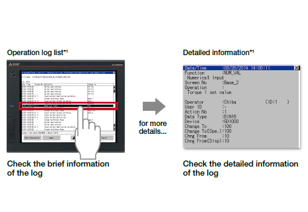

# MELFA ROS2 iQ Platform
_**Technology Convergence of Open Source and Factory Automation**_

This document provides an introduction to GOT-HMI. For setup instructions, refer to [MELSOFT Simulators Setup Guide](./melsoft_setup.md).

# 1. Introduction to GOT-Human Machine Interface

The GOT-Human Machine Interface includes a variety of features to provide quality-of-life improvements to operators, streamline automation procedures and contribute to overall productivity. Below is a list of notable functions that could be useful in a ROS2 application:

1. Network Attached Storage
2. Multi-channel/Device Data Transfer
3. GOT Web-based Remote Solutions
4. Security Systems
5. IT Gateway

- For more information, refer to the [manuals](https://www.mitsubishielectric.com/fa/products/hmi/got/smerit/gt_works3/manual/index.html).

## 1.1 Network Attached Storage

A network attached storage (NAS) can be realized using the [Network Drive](https://www.mitsubishielectric.com/fa/products/hmi/got/pmerit/got2000/got_solutions/case_70.html) function. __Click on the image to learn more!__
 

 

### Function features

The network drive can be used as the save destination for the GOT files. By setting the shared folder on the file server (personal computer) connected by Ethernet as the network drive, the files can be saved directly to the shared folder from the GOT. Use the external storage to accumulate data without considering the GOT memory size or the SD memory card capacity.

REV: Why the NAS function is needed.
### Saving data to file server

Since files can be saved directly to the file server from multiple GOTs, you can view necessary data just by accessing the server.

- For more information click [here](https://www.mitsubishielectric.com/fa/products/hmi/got/pmerit/got2000/got_solutions/case_70.html).

REV: No need for a separate heading here.

## 1.2 Multi-channel/Device Data Transfer

The GOT-HMI can be used as a hub to operate and monitor multiple controllers from various manufacturers. __Click on the image to learn more!__
 

 

### Function features

GOT supports various industrial devices and connection types. With the multi-channel function and the device data transfer function, multiple types of industrial devices from different manufacturers can be monitored. Device memory can be mapped between different manufacturers, allowing communication of, otherwise, incompatible devices.

### Multi-channel

Up to four channels* of industrial devices (programmable controller, servo, inverter, temperature controller, etc.) can be monitored with one GOT.
 

 

### Device Data Transfer

Using GT Works3, simply set source devices, destination devices, and triggers and you can transfer devices between industrial devices.
 

 

- For more information click [here](https://www.mitsubishielectric.com/fa/products/hmi/got/pmerit/got2000/got_solutions/case_43.html).

## 1.3 GOT Web-based Remote Solutions

Have you run into these problems? If so, [GOT-Web-based remote solutions](https://www.mitsubishielectric.com/fa/products/hmi/got/pmerit/got2000/got_solutions/got_solutions01.html) is what you're looking for. __Click on the image to learn more!__
 

 

The image below illustrates an overview of various GOT Web-based remote functions working together to provide a complete OT IoT solution.
 

 

### GOT Mobile

The GOT Mobile function utilizes existing GOT-HMIs or SoftGOT computers to host a local webserver. Operators can access the GOT remotely using a web browser. __Click on the images below to learn more!__
 

 

### Function features

Via GT SoftGOT2000, connected devices can be monitored from information devices such as tablets. By using the GOT Mobile function on GT SoftGOT2000, it is possible to build a larger monitoring system and collectively monitor the information.

- For more information about GOT Web-based solutions, click [here](https://www.mitsubishielectric.com/fa/products/hmi/got/pmerit/got2000/got_solutions/got_solutions01.html).

## 1.4 Security Systems

To protect customers’ assets, GOT offers enhanced security functions such as access restriction on project data and access restriction via network. __Click on the image below to learn more!__
 

 

### Operator Log

GOT records all the operations performed by operators. Checking the recorded operation history helps you to identify and analyze the cause of the error that occurred due to improper operations, leading to making improvements, preventing reoccurrence, and enhancing traceability. When used with __Operator Authentication__ function, every action can be traced back to an operator. __Click on the image below to learn more!__
 

 

### Function features
GOT records the operation information, such as the “what, when, and how” of an operation performed, in chronological order in an SD memory card or USB memory. Use of the operation log function combined with the operator authentication function records additional information of “who” performed the operation.

### Operator Authentication

Operator name and password enable the secure login management in a large-scale shop floor, providing the flexibility of setting the operation authority per shop floor or operator. In addition, the login management can be performed by an external authentication device such as RFID.

 

 

### Function features

Setting the operation authority and the viewing authority achieves “enhanced security” and allows “access management per operator”. Use of the operator authentication function combined with the operation log function enables you to check the “who, what, when, and how” of an operation performed.

- For more information about GOT Security & Additional functions, click [here](https://www.mitsubishielectric.com/fa/products/hmi/got/pmerit/got2000/got_solutions/case_33.html).

## 1.5 IT Gateway

The GENESIS64™ SCADA software can collect the information of devices on each equipment via GOT2000 or GT SoftGOT2000 that is installed on the shop floor. This is useful not only for monitoring the operation status of equipment in each factory, but also for advanced preventive maintenance and predictive maintenance. __Click on the image below to learn more!__
 

 

### Function features
The GENESIS64™ SCADA software can collect the data of connected devices via gateway devices of GOT2000 or GT SoftGOT2000 that acts as a gateway server. After establishing correlation between GENESIS64™ and GOT2000 gateway devices, the users can make settings with familiar tags on SCADA without worrying about actual device names. __OPC Servers are NOT required__

- For more information about GOT connectivity, click [here](https://www.mitsubishielectric.com/fa/products/hmi/got/pmerit/got2000/got_solutions/case_49.html).

# 2. MELFA ROS2 I/O operations using GOT-HMI

The MELFA ROS2 Driver includes a [ros2_control](https://control.ros.org/humble/index.html) compliant GPIO controller package. The GPIO controller package provides 7 controllers by default. For CR800-R robot controller, 5 out of 7 controllers are mapped to different sections of the iQ Platform buffer memory. GOT-HMI can access the robot controller memory via the iQ Platform to communicate with ROS2.

You can refer to the [I/O parameters](https://github.com/Mitsubishi-Electric-Asia/melfa_ros2_driver/blob/humble/melfa_description/config/custom_io_params.yaml) in the MELFA ROS2 Driver for more information on the memory mapping configurations.

The overall concept for interfacing with iQ Platform buffer memory is transferable to CR800-D. GOT-HMI can communicate directly with CR800-D controller without MELSEC iQ-R controllers. However, it does not benefit from the iQ-R shared buffer memory. You can learn more about this at [MELFA ROS2 Integrated System Simulators](https://github.com/Mitsubishi-Electric-Asia/melfa_ros2_syssim) where a CR800-D robot controller is connected to GOT-HMI directly using GOT Drive.

# 3. Conclusion

GOT-HMI is integral to smart factories. GOT-HMI brings a suite of IoT, security and data monitoring functions with an emphasis on operator accessibility. Through the iQ Platform, GOT-HMI can monitor a suite of devices and production lines (new and old), and enhance them with modern features to improve productivity. With iQ Platform, ROS<>OT<>IT convergence is not just an idea but a reality.

- [MELFA ROS2 & MELSOFT setup guide](./melsoft_setup.md): Setup and configuration of MELSOFT simulators