# MELFA ROS2 iQ Platform
_**Technology Convergence of Open Source and Factory Automation**_

This document provides a guided tutorial for MELFA ROS2 iQ Platform. For setup instructions, refer to [MELSOFT Simulators Setup Guide](../doc/melsoft_setup.md).

## Overview

This document contains 3 chapters. By the end of this tutorial, you will be able to create your own node to communicate with GOT-Human Machine Interfaces.

This tutorial has 3 chapters:

- Chapter 1 explains how to set up the MELFA ROS2 Driver and connect to MELSOFT Simulators for system-level testing using the iQ Platform.

- Chapter 2 provides a step-by-step tutorial to interact with GT Simulator using ROS2 CLI via MELFA ROS2 Driver.

- Chapter 3 provides a step-by-step tutorial to interact with RT Toolbox3 Simulator robot hand using ROS2 CLI via MELFA ROS2 Driver. The hands states are reflected in GT Simulator.

The simulated hardware architecture is similar to [GOT Drive Robot](https://www.mitsubishielectric.com/fa/products/hmi/got/pmerit/got2000/got_solutions/case_45.html).
<br/>

[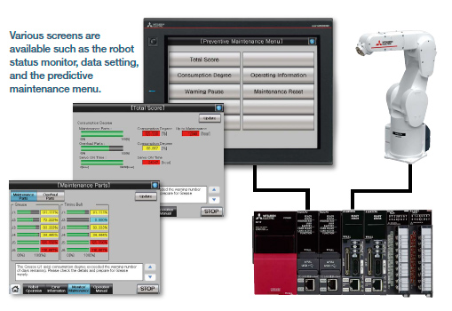](https://www.mitsubishielectric.com/fa/products/hmi/got/pmerit/got2000/got_solutions/case_45.html)

</br>

## 1. Connect to MELSOFT Simulators

This section provides a guide to connect to MELSOFT RT Toolbox3 Simulator.

RT Toolbox3 creates a system simulation of the RV-13FRL-R Industrial robot with its robot controller(in this example, CR800-R). The simulator simulates the _Real Time External Command_ Ethernet function and virtual memory allocation, allowing ROS2 to connect to the simulation as if it is a real robot with true-to-system dynamics and addressable memory.

### 1.1 Hardware Connection

Ensure that your Ubuntu and Windows devices are connected to the same LAN.

Ensure that your Windows device is able to ping your Ubuntu device. Your Ubuntu device may not be able to ping your Windows device due to some Windows' firewall configurations. If your Windows device is able to ping your Ubuntu device, your devices are connected.

Please refer to [MELFA ROS2 Driver Setup](https://github.com/Mitsubishi-Electric-Asia/melfa_ros2_driver/blob/humble/doc/melfa_ros2_driver.md) for setup instructions.

### 1.2 Launch MELFA ROS2 Driver [Terminal 1]

Open a new terminal. Source your MELFA workspace and connect to the simulation with the command below.
```bash
# Terminal 1

ros2 launch melfa_bringup rv13frl_control.launch.py use_fake_hardware:=false controller_type:="R" robot_ip:=<MELSOFT_PC_IP_address> packet_lost_log:=0
```
Example:
```bash
# Terminal 1

ros2 launch melfa_bringup rv13frl_control.launch.py use_fake_hardware:=false controller_type:="R" robot_ip:=192.168.3.200 packet_lost_log:=0
```

#### Explanation
In the command executed, notice "controller_type:="R"" is used. MELFA ROS2 is compatible with MELFA FR, CR and AS series of robots which share the CR800 robot controller family. The CR800 family consist of CR800-R, CR800-Q and CR800-D.

CR800-R/Q both supports sequencer link with MELSEC IQ-R PLCS, fully utilizing the advantages of the iQ Platform. For information on the iQ Platform and how it can be leveraged using MELFA ROS2, refer to [MELSEC Intro](./melsec_info.md).

### 1.3 Run IQNode [Terminal 2]

Open a new terminal. Source your MELFA workspace and run the command below.
```bash
# Terminal 2

ros2 run melfa_iq_node iq_

```
You should see the outputs below.
```bash
#Terminal 2

[INFO] [1743502065.212053515] [iq_]: Configuring plc_link_io to 11008
[INFO] [1743502065.212272620] [configure_io_]: Reading...
[INFO] [1743502065.212741766] [configure_io_]: Service Success
[INFO] [1743502065.212942997] [iq_]: Configuring hand_io to 900
[INFO] [1743502065.213080117] [configure_io_]: Reading...
[INFO] [1743502065.213207028] [configure_io_]: Service Success
```
#### Explanation
The [configure_io_ ] logger is from the function `void configure_io()`. This function creates a temporary service client to execute a service call to `/gpio_controller/configure_gpio` service. The `/gpio_controller/configure_gpio` service configures the MELFA ROS2 GPIO controllers. The initialization procedure programmed in the IQNode configures 2 GPIO interfaces to monitor the state of the input memory of the robot controller at the designated addresses.

## 2. Interface with MELSOFT Simulators with ROS2 Command Line Interface

This section provides a guide to interface with the MELSOFT Simulators on the Windows device.


### 2.1 I/O Operation via iQ Platform

You will use the ROS2 CLI to toggle individual lamps on GT Simulator and perform batch writes to toggle multiple lamps using hexadecimal. The same operation can be performed with other iQ Platform hardware such as [MELSEC controllers](./melsec_info.md), [FREQROL inverters (VFD)](https://www.mitsubishielectric.com/fa/products/drv/inv/index.html) and [CNC controllers](https://www.mitsubishielectric.com/fa/products/cnt/cnc/pmerit/cnc/c80/).

 __On the GT Simulator__

1. Select "Robot Operation".
<br/>

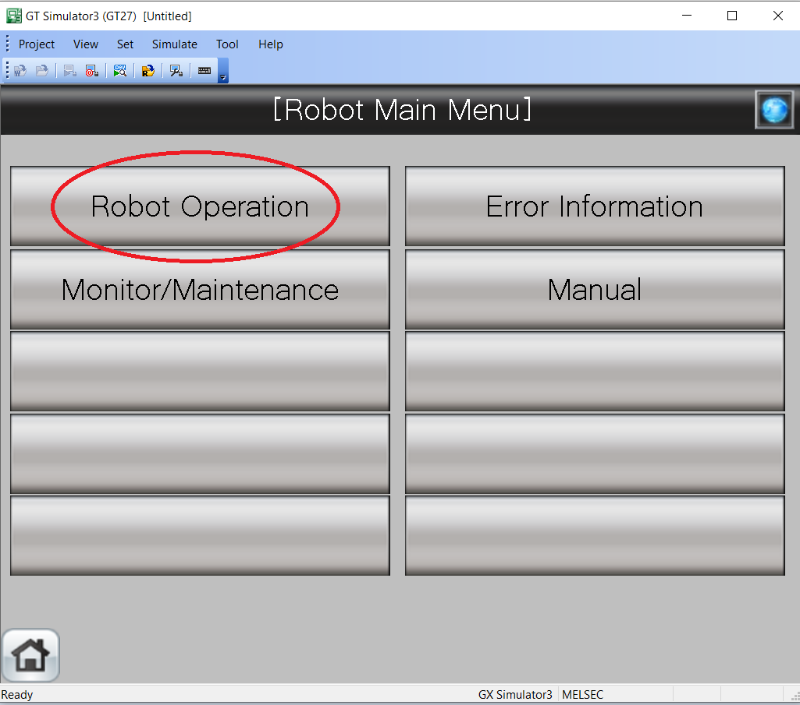

</br>

2. Select "Robot OP"
<br/>

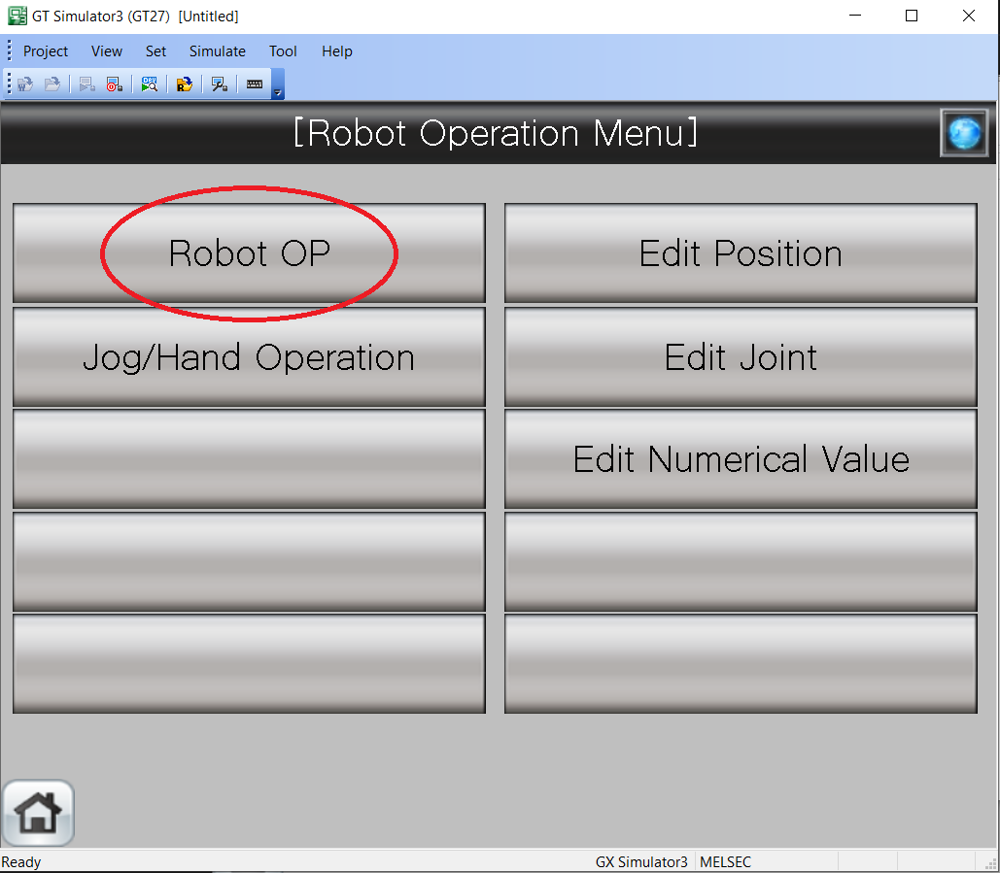

</br>

3. Select "Robot Operation" followed by "User I/O".
<br/>

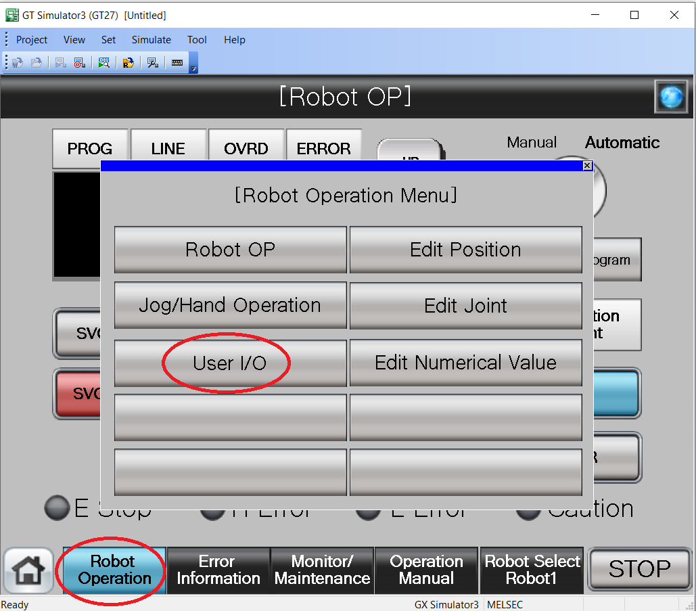

</br>

4. You will see the screen you created during the setup.
<br/>

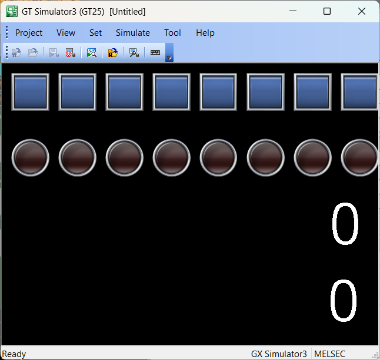

</br>

__On the Ubuntu device__

Open two new Terminals [Terminal 3] & [Terminal 4].

In [Terminal 3], run the command below.
```bash
# Terminal 3

ros2 topic echo /hmi_/button_state
```
You should see the following.
```bash
# Terminal 3
---
button_0: false
button_1: false
button_2: false
button_3: false
button_4: false
button_5: false
button_6: false
button_7: false
button_8: false
button_9: false
button_10: false
button_11: false
button_12: false
button_13: false
button_14: false
button_15: false
---
```
To turn on a lamp on the GT Simulator, run the command below.
```bash
# Terminal 4

ros2 topic pub /hmi_/button_command melfa_iq_msgs/msg/ButtonState "{button_3: true}"
```
You will see the following.
```bash
# Terminal 4

publisher: beginning loop
publishing #1: melfa_iq_msgs.msg.ButtonState(button_0=False, button_1=False, button_2=False, button_3=True, button_4=False, button_5=False, button_6=False, button_7=False, button_8=False, button_9=False, button_10=False, button_11=False, button_12=False, button_13=False, button_14=False, button_15=False)
```

You can interrupt the terminal with Ctrl+C after it has published at least once. The GT Simulator will show the following.
<br/>

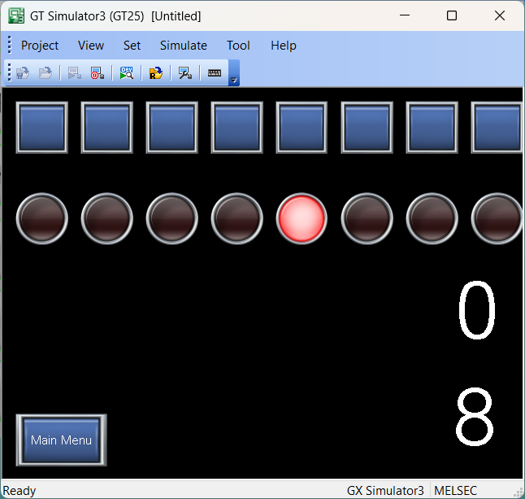

</br>
On the GT Simulator, click on the first 3 buttons from the right. You should see the following.
<br/>

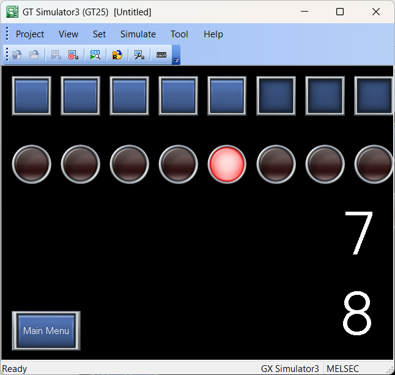

</br>
In [Terminal 3], you should see the following. Observe that button_0,1 & 2 are "true".

```bash
# Terminal 3

---
button_0: true
button_1: true
button_2: true
button_3: false
button_4: false
button_5: false
button_6: false
button_7: false
button_8: false
button_9: false
button_10: false
button_11: false
button_12: false
button_13: false
button_14: false
button_15: false
---
```
You can perform a batch-write operation by running the service call below.
```bash
# Terminal 4

ros2 service call /gpio_controller/configure_gpio melfa_msgs/srv/GpioConfigure "{bitid: 11008, mode: 'WRITE_OUT', bitdata: 0xaaaa, bitmask: 0xffff}"
```
The GT Simulator will show the following. The numeric value "43690" represents the data written "0xAAAA" in unsigned int 16-bit. The ROS2 message variable "bitdata" accepts 0b, 0x and unsigned int. Please try out different values and observe how it is reflected on GT Simulator.
<br/>

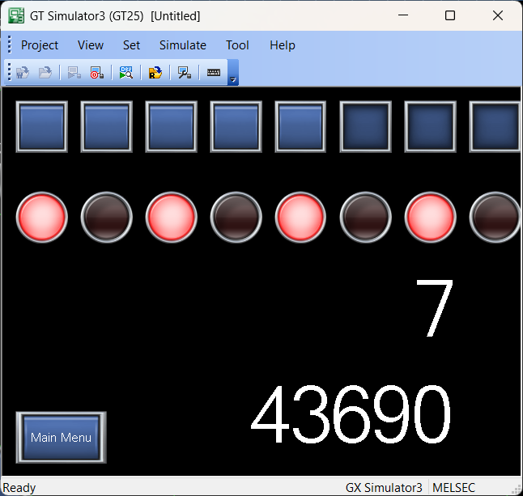

</br>

#### Explanation

The 8 buttons on the GT Simulator are mapped to robot controller's GPIO input port 11008 to 11023. When a button is pressed, GT Simulator writes a HIGH value to the assigned robot input bit address. The IQNode performs batch reads on the assigned addresses and maps them to the /hmi_/button_state topic.

The 8 lamps on the GT Simulator are mapped to robot controller's GPIO output memory 11008 to 11023. When a button command is sent, the IQNode reads /hmi_/button_command and maps it to a 16-bit hexadecimal. The IQNode performs batch write to the assigned robot output addresses. GT Simulator reads the robot output addresses and toggle the assigned lamps.

### 2.2 Robot Hand Operation

In this section, you will operate the robot hand using ROS2 CLI.

#### Check the Hand State On the GT Simulator

1. Select "Main Menu" button at the bottom left of the screen.
<br/>

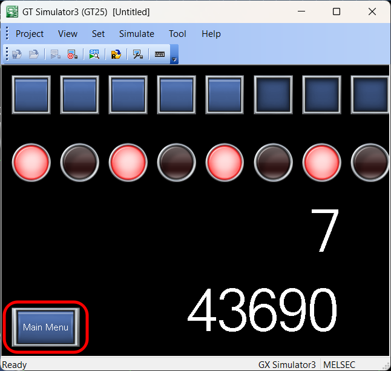

</br>

2. Select "Jog/Hand Operation" button.
<br/>

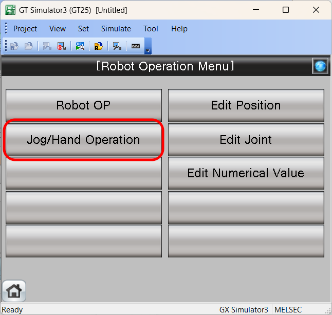

</br>

3. Observe the buttons on the right side of the screen. These buttons represent the double solenoid hand states. These buttons can also be used to toggle the hands but it does not work when a robot program is running to prevent race conditions.
<br/>

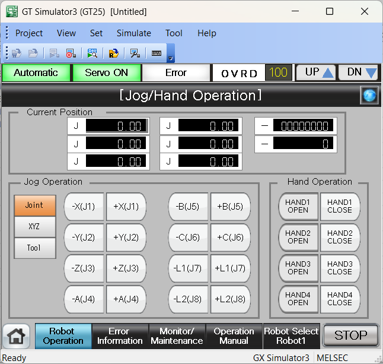

</br>

#### Publish the Hand Message On the Ubuntu Device

1. In [Terminal 3], run the command below.
```bash
# Terminal 3

ros2 topic echo /robot_/gripper_state
```
You should see the following.
```bash
# Terminal 3
---
double_solenoid: true
hand_1: false
hand_2: false
hand_3: false
hand_4: false
hand_5: false
hand_6: false
hand_7: false
hand_8: false
---
```

2. In [Terminal 4], run the command below.
```bash
# Terminal 4

ros2 topic pub /robot_/gripper_command melfa_iq_msgs/msg/GripperState "{double_solenoid: true, hand_1: true, hand_2: true}"
```
You should see the following.
```bash
# Terminal 3
---
double_solenoid: true
hand_1: true
hand_2: true
hand_3: false
hand_4: false
hand_5: false
hand_6: false
hand_7: false
hand_8: false
---
```
#### Observe the Change On the GT Simulator

Observe that the state of the hands are updated.
<br/>

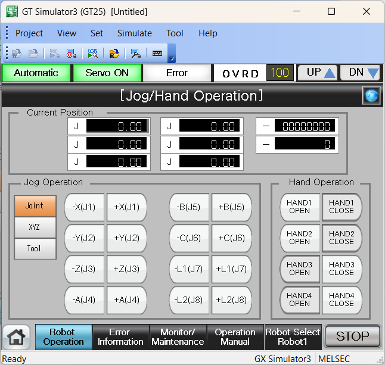

</br>

# 3 Conclusion

You have come to the end of the tutorial for MELFA ROS2 iQ Platform sample program. It is highly recommended to explore the source code of [IQNode](../melfa_hmi_sample/src/iq_.cpp) further and observe how the I/O operations can be implemented in the ROS2 environment. Here is a [code_walkthrough](../doc/code_walkthrough.md).

If you have any questions regarding this repository or require any help, feel free to leave a comment on our [discussion page](https://github.com/orgs/Mitsubishi-Electric-Asia/discussions).