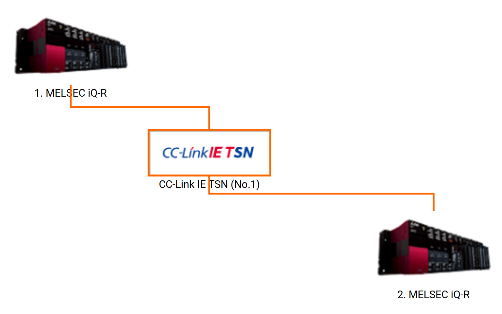

# MELFA ROS2 iQ Platform
_**Technology Convergence of Open Source and Factory Automation**_

This document provides an introduction to MELSEC and iQ Platform. For setup instructions, refer to [MELSOFT Simulators Setup Guide](../doc/melsoft_setup.md).

# 1. Introduction to MELSEC Controllers

### MELSEC iQ-R

The core of the MELSEC iQ-R Series, the programmable controller CPU, includes various features such as an embedded database and high-speed processing that enable it to perform a wide range of control tasks. Five CPUs are available depending on program capacity (40K to 1200K steps).

- [Learn more about MELSEC iQ-R](https://www.mitsubishielectric.com/fa/products/cnt/plcr/pmerit/concept/index.html)

### MELSEC iQ-F

The MELSEC iQ-F Series is a compact next-generation controller that includes many integrated functions, enhanced processing performance, user-centric programming and improved connectivity to drive related control.

- [Learn more about MELSEC iQ-F](https://www.mitsubishielectric.com/fa/products/cnt/plcf/pmerit/concept/index.html)

### iQ Platform: Advanced, high-speed integrated controllers

The MELSEC controller used in this sample program is the MELSEC iQ-R series, featuring the iQ Platform with multi-CPU, multi-network, multi-redundancy, microsecond cycle times and sub-millisecond memory sharing capabilities. For sample programs related to MELSEC iQ-F controllers, refer to [MELFA ROS2 Integrated System Simulators](https://github.com/Mitsubishi-Electric-Asia/melfa_ros2_syssim/) repository.

# 2. Introduction to iQ Platform

The iQ Platform realizes consolidated controllers on one common platform. Various different controllers responsible for different aspects of automation control can be used together on one high-speed system bus. The various control CPUs utilize high-speed data communication via the backplane, further reducing cost as additional networks are not required and improving performance owing to the platform’s large data bandwidth capability.

By integrating MELFA ROS2 with iQ Platform, ROS2 can leverage ___certified___ industrial controllers to create safe, robust and reliable solutions.

Below is a list of Mitsubishi Electric Factory Automation products that can leverage this technology:

1. Programmable controller
2. Motion controller
3. C controller
4. Process controller
5. CNC controller
6. Robot controller

- [Learn more about iQ Platform](https://mitsubishielectricfa.com.my/wp-content/uploads/2021/03/iQ_Platform.pdf)

## 2.1 High Speed Buffer Memory Synchronization

The iQ Platform allows high speed communication of buffer memory for up to 4 CPUs. 1 PLC CPU and 3 other CPUs from
The image below depicts a typical iQ Platform configuration involving a MELSEC iQ-R controller and a MELFA robot. Observe that the PLC CPU (in slot "CPU") and the robot CPUs (in slot "0","1" & "2") are attached to the same backplane.

 

 

For this configuration, MELFA robot maps iQ-R controller memory address: U3E0\HG0 to U3E0\HG511 to robot input: 10000 to 18191. The iQ-R controller maps robot output addresses: 10000 to 18191 to iQ-R memory address: U3E1\HG0 to U3E1\HG511. Do note that robot I/O memory is a binary data type while iQ-R U3En\HG# memory is short integer.

So one short int is 16 bit

In multi-robot coordination scenarios, the memory addresses are mapped by default based on the table below. The "source" is mapped to the "destination". In other terms, "source" is the OUTPUT and destination is the "INPUT".

<table>
<head>
</head>
    <tr>
        <th colspan="1">iQ-R memory address</th>
        <th colspan="1">Robot 1 address</th>
        <th colspan="1">Robot 2 address</th>
        <th colspan="1">Robot 3 address</th>
    </tr>
    <tr>
        <td>U3E0\HG0 to 511 (source)</td>
        <td>INPUT 10000 to 18191 (destination)</td>
        <td>Not applicable</td>
        <td>Not applicable</td>
    </tr>
    <tr>
        <td>U3E1\HG0 to 511 (destination)</td>
        <td>OUTPUT 10000 to 18191 (source)</td>
        <td>Not applicable</td>
        <td>Not applicable</td>
    </tr>
    <tr>
        <td>U3E0\HG512 to 1023 (source)</td>
        <td>Not applicable</td>
        <td>INPUT 10000 to 18191 (destination)</td>
        <td>Not applicable</td>
    </tr>
    <tr>
        <td>U3E2\HG0 to 511 (destination)</td>
        <td>Not applicable</td>
        <td>OUTPUT 10000 to 18191 (source)</td>
        <td>Not applicable</td>
    </tr>
    <tr>
        <td>U3E0\HG1024 to 1535 (source)</td>
        <td>Not applicable</td>
        <td>Not applicable</td>
        <td>INPUT 10000 to 18191 (destination)</td>Setup
    </tr>
    <tr>
        <td>U3E3\HG0 to 511 (destination)</td>
        <td>Not applicable</td>
        <td>Not applicable</td>
        <td>OUTPUT 10000 to 18191 (source)</td>
    </tr>
</table>

The CPUs "Robot 2" and "Robot 3" can be swapped out for any other iQ Platform controllers such as CNC, Motion & Process controllers. This does not include physical I/O modules and industrial network modules (CC-Link IE TSN, CC-Link IE Field, OPC UA, EtherNet/IP, PROFINET/BUS, MODBUS) because they are not CPUs. The data from these controllers can be mapped to the MELFA robot controller memory. Once the memory mapping is implemented, read/write operations can be performed between MELFA ROS2 and other iQ Platform controllers. Physical I/O modules and industrial network modules are usually interfaced with a Programmable controller which can interface with MELFA ROS2 via the iQ Platform.

You can learn more about the iQ Platform by experiencing the wide range of compatible controllers using our [FA Integrated Selection Tool](https://www.mitsubishielectric.com/fa/products/select/index.html).

## 2.2 Configuration Example

Below is a typical dual iQ Platform system created using our [FA Integrated Selection Tool](https://www.mitsubishielectric.com/fa/products/select/index.html). The purpose of this system is to serve as an example of what can be created using iQ Platform. It will not be used in the tutorial exercises.

There are 2 MELSEC iQ-R platforms connected together via CC-Link IE Time Sensitive Network. The first MELSEC iQ-R configuration is running a multi-robot operation with 3 robots. The second MELSEC iQ-R configuration is running a safety program to ensure that the system as a whole is safe and compliant to industrial standards.
 

 

The first MELSEC iQ-R configuration consists of 1 Programmable controller, 3 Robot controllers, CC-Link IE TSN network module and digital & analog I/O modules.
 

 

These are the details of the modules on the first MELSEC iQ-R system.
 

 

The second MELSEC iQ-R configuration consists of 1 Safety controller, safety I/O modules and CC-Link IE TSN network module.
 

 

These are the details of the modules on the second MELSEC iQ-R system.
 

 

Through careful implementation, ROS2 can be implemented as part of the iQ Platform via MELFA ROS2 Driver.

## 2.3 MELFA ROS2 I/O operations via iQ Platform

The MELFA ROS2 Driver includes a [ros2_control](https://control.ros.org/humble/index.html) compliant GPIO controller package. The GPIO controller package provides 7 controllers by default. For CR800-R robot controller, 5 out of 7 controllers are mapped to different sections of the iQ Platform buffer memory. In other words, MELFA ROS2 can perform read/write operations to 80-bits of data in series where each 16-bit operation is performed in 3.5 milliseconds.

You can refer to the [I/O parameters](https://github.com/Mitsubishi-Electric-Asia/melfa_ros2_driver/blob/humble/melfa_description/config/custom_io_params.yaml) in the MELFA ROS2 Driver for more information on the memory mapping configurations.

The overall concept for interfacing with iQ Platform buffer memory is transferable to CR800-D CC-Link IE Field Basic communication. For CR800-D, it does not benefit from the iQ-R shared buffer memory. Thus, the communication with MELSEC controllers have to be implemented via CC-Link IE Field Basic. You can learn more about this at [MELFA ROS2 Integrated System Simulators](https://github.com/Mitsubishi-Electric-Asia/melfa_ros2_syssim) where a CR800-D robot controller is connected to a MELSEC iQ-F FX5UJ controller.

# 3. Conclusion

MELSEC Controllers are not just PLCs. MELSEC is a platform for integrated solutions with various specialized products. The iQ Platform enables this collaboration. With iQ Platform, ROS<>OT<>IT convergence is not just an idea but a reality.

- [MELFA ROS2 & MELSOFT setup guide](./melsoft_setup.md): Setup and configuration of MELSOFT simulators