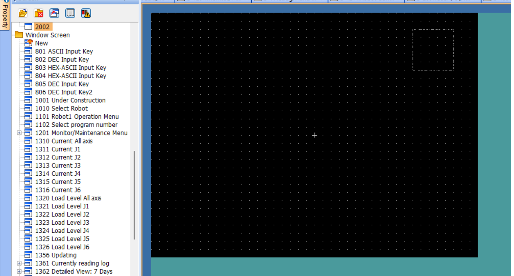

# MELFA ROS2 & MELSOFT Simulator Setup

This setup guide is divided into two parts:
1. Setting up ROS2 related packages on the Linux machine.
2. Setting up MELSOFTs on the Windows machine.

## 1. MELFA ROS2 Setup

This section provides a guide to set up MELFA ROS2 Driver and MELFA ROS2 iQ Platform  on your __Ubuntu 22.04LTS device__.

### 1. Create your MELFA workspace
```bash
mkdir -p ~/melfa_ws/src
cd ~/melfa_ws/src
```

### 2. Download [MELFA ROS2 iQ Platform](https://github.com/Mitsubishi-Electric-Asia/melfa_ros2_iq/releases) from GitHub.

Cloning is not recommended as the latest version of MELFA ROS2 HMI may have compatibility issues with the latest version of MELFA ROS2 Driver.

### 3. Download [MELFA ROS2 Driver](https://github.com/Mitsubishi-Electric-Asia/melfa_ros2_driver/releases) from GitHub.

Cloning is not recommended as the latest version of MELFA ROS2 Driver may have compatibility issues with the latest version of MELFA ROS2 HMI.

### 4. Extract MELFA ROS2 Driver to melfa_ws/src.
Ensure that melfa_ros2_driver-1.0.5 and this version of melfa_ros2_hmi are in melfa_ws/src.

Please refer to [MELFA ROS2 Driver Setup](https://github.com/Mitsubishi-Electric-Asia/melfa_ros2_driver/blob/humble/doc/melfa_ros2_driver.md).

### 5. Update package dependency sources
```bash
cd ~/melfa_ws
rosdep update
```
### 6. Install dependencies
```bash
cd ~/melfa_ws
rosdep install -r --from-paths . --ignore-src --rosdistro humble -y --skip-keys warehouse_ros_mongo
```
### 7. Open a terminal and build melfa_ws.
```bash
cd ~/melfa_ws
colcon build --cmake-args -DCMAKE_BUILD_TYPE=Release
```
Your MELFA workspace is ready!

## 2. MELSOFT Simulator Setup

This section provides a guide to set up MELFA ROS2 iQ Platform on your __Windows device__.

### 2.1 GX Works3 Setup & Simulation

> ℹ️ If you are on __Windows 11__, launch GX Works3 as administrator for better performance.

Click on the "new" icon in the top left corner of the window. Select "RCPU" and "R04" then select "OK".


<br>

1. Select the "Module Configuration" and select it.
<br/>


<br>

2. Select "element selection". Look for "R33B", drag and drop it onto the grid.
<br/>


<br>

3. Select "element selection". Look for "R16RTCPU", drag and drop it onto the grid.
<br/>


<br>

4. Select "element selection". Look for "R61P", drag and drop it onto the grid.
<br/>


<br>

5. Drag and drop the items on the grid into the slots as seen below. The items should snap into the slots.
<br/>


<br>

6. Save and close the "Module Configuration" window. The pop-up below will appear. Select "Yes".
(use CTRL+S to save!)
<br/>


<br>

7. Navigate "Parameter" -> "System Parameter" to open the "System Parameter" window. Select "Multiple CPU Setting" -> "Multiple CPU Setting" to get to the page shown below.
<br/>


For our setup change these settings:
- PLC Unit Data: Enable
- Fixed Scan Communication Function: Use
- PLC No.1 [Start XY: U3E0] : 1K Word
- PLC No.2 [Start XY: U3E1] : 1K Word

Leave the other settings as default.

>ℹ️ iQ Platform provides various ways to set up the system, to know more, download the manual from the manual [CR800-R/CR800-Q series controller iQ Platform Supporting Extended Function Instruction Manual (English)](https://www.mitsubishielectric.com/fa/download/search.page?mode=manual&kisyu=/robot&q=CR800-R%2FCR800-Q%20series%20controller%20iQ%20Platform%20Supporting%20Extended%20Function%20Instruction%20Manual%20(English)&sort=0&style=0&lang=2&category1=0&filter_discontinued=0&filter_bundled=0).Page 28, "(1) Multiple CPU Configuration with One Squencer plus One Robot" is what we are using for this package.

<br>

8. Select "Convert" -> "Convert" to convert the program.
<br/>


</br>

9. Select "OK".
<br/>


</br>

10. Select "Convert" -> "Rebuild All" to rebuild the program.
<br/>


</br>

11. Select "OK".
<br/>


</br>

12. Select [Debug]&#8594;[Simulation]&#8594;[Start Simulation].
<br/>


</br>

13. The simulator may take a few moments to get ready. When the simulator is ready, the window below will appear as is.
<br/>


</br>

The GX Simulator is READY!

### 2.2 RT Toolbox3

> ℹ️ If you are on __Windows 11__, launch RT Toolbox3 as administrator for better performance.

1. Select "Home" -> "New". Type in the workspace name and select "OK".
<br/>


</br>

2. In the pop-up window, select "Robot Model" and select the parameters as shown in the image below. Then select "Finish".
<br/>


</br>

3. Select Cancel.
<br/>


</br>

4. Select "I/O Simulator" -> "Simulator Settings" to open the "Simulator Settings" window. From the window, Select "Add..." and input the parameters as shown in the image below.then select "OK".
<br/>


</br>

5. Select "Add..." and input the parameters as shown in the image below, then select "OK".
<br/>


We will repeat this process for 7 times, a total of 7 Signal Connection will be added.

<br>

__Robot Controller OUT -> PLC__


| Simulation Operation | Signal Type | Source/Reference Side | IN/OUT | Source/Start # | Source/End # | Destination/Setting Side | Destination/Start # | Destination/End # | Destination/Device |
| -------------------- | ----------- | --------------------- | ------ | -------------- | ------------ | ------------------------ | ------------------- | ----------------- | ------------------ |
| Signal Value Copy    | PIO         | 1:RC1                 | OUT    | 11008          | 11039        | GX Simulator3 #1         | 64                  | 65                | U3E1\HG            |
| Signal Value Copy    | PIO         | 1:RC1                 | OUT    | 10000          | 10031        | GX Simulator3 #1         | 0                   | 1                 | U3E1\HG            |
| Signal Value Copy    | PIO         | 1:RC1                 | OUT    | 10032          | 10063        | GX Simulator3 #1         | 2                   | 3                 | U3E1\HG            |

__PLC->Robot Controller & Robot Controller OUT -> Robot Controller IN

| Simulation Operation | Signal Type | Source/Reference Side | Source/Device | Source/Start # | Source/End # | Destination/Setting Side | Destination/Start # | Destination/End # | IN/OUT |
| -------------------- | ----------- | --------------------- | ------------- | -------------- | ------------ | ------------------------ | ------------------- | ----------------- | ------ |
| Signal Value Copy    | PIO         | GX Simulator3 #1      | U3E0/HG       | 64             | 65           | 1:RC1                    | 11008               | 11039             | IN     |
| Signal Value Copy    | PIO         | GX Simulator3 #1      | U3E0/HG       | 0              | 1            | 1:RC1                    | 10000               | 10031             | IN     |
| Signal Value Copy    | PIO         | GX Simulator3 #1      | U3E0/HG       | 2              | 3            | 1:RC1                    | 10032               | 10063             | IN     |
| Signal Value Copy    | PIO         | 1:RC1                 | Bit Device    | 900            | 931          | 1:RC1                    | 900                 | 931               | IN     |

__You should have 7 items in total when finishing the IO Simulator setting.__

</br>

6. Select "Save" on the bottom right of the window. In the pop-up window, type in a file name and click "Save".
<br/>


</br>

7. Select the green "Simulator" button on the top bar of the screen as shown in the image below. Ensure that "RC1" and the checkbox beside "Start I/O Simulator...." are checked. Select "OK".
<br/>


</br>

8. From the "Workspace" panel on the left side on the window, select "Simulation" followed by "Program". Type in a program name and select "OK".
<br/>


</br>

9. Type in the program shown below and replace "192.168.3.150" with your Ubuntu device local IP address. Use Ctrl+S to save your program.
<br/>


</br>

10. To run the program created, follow the steps shown in the image below. Select "Simulation" followed by "Operation Panel". In the green pop-up window which is the operation panel, select the "select" button, select your program in the new pop up window and select ok. Select the blue "START" button on the operation panel.
<br/>


</br>

__The RT Toolbox3 Simulator is READY!__


### 2.3 GT Works3 Setup & Simulation

1. Download the [GOT-HMI sample program for CR800-R](https://www.mitsubishielectric.com/fa/download/software/detailsearch.page?mode=lib&kisyu=/robot&shiryoid=1000000331&lang=2&select=0&softid=3&infostatus=3_1_3&viewradio=0&viewstatus=&viewpos=). Extract the zip file and launch "MELFA_FRR_GOT_SAMPLE_SCRIPT_V008a_e.GTX". If you are on __Windows 11__, launch as administrator for better performance.
<br/>

2. Select "Screen" near the bottom of the screen. On the left panel, select "Base Screen" followed by "New". In the pop-up, type in the information as shown in the image below. Then select "OK".
<br/>


</br>

3. You will see an empty screen similar to the image below.
<br/>



4. Select the switch icon on the right panel, then click and drag to create a switch on the screen.


</br>

5. Double click on the switch you have just created. In the pop-up window, select "Bit..." and enter the information as shown in the smaller pop-up window and select "OK". On the bottom of the initial pop-up window, select "Bit-ON/OFF" and type in the information as shown below. This switch will be known as button 0 and it is linked to the memory address U3E0-64.b0.
<br/>


</br>

6. Select the lamp icon on the right panel, then click and drag to create a lamp on the screen. Double click on the lamp you have just created. In the pop-up window, type in and follow the information shown in the image below. Then select "OK". This lamp will be known as lamp 0 and it is linked to the memory address U3E0-64.b0.
<br/>


</br>

7. Create 7 more switches with addresses "U3E0-64.b1" to "U3E0-64.b7" and create 7 more lamps with addresses "U3E1-64.b1" to "U3E1-64.b7". The switches and lamps should be arranged as shown below, with button/lamp 0 to 7 from right to left, similar to 0b00000000.

</br>

8. Select the "Numerical Display/Input" icon, click and drag to create a numeric display. Do this twice to create two displays as shown in the image below.
<br/>


</br>

9. Double click on the display that is above the other display. Input the information into the pop-up window as shown below. Select "OK".
<br/>


</br>

10. Double click on the display that is below the other display. Input the information into the pop-up window as shown below. Select "OK".
<br/>


</br>

11. Select the "Switch" icon, click and drag to create a new switch in the area of the screen shown in the image below.
<br/>


</br>

12. Double Click on the switch you just created. Select "Text" on the top bar. Type in "Main Menu" as shown in the image below.
<br/>


</br>

13. Select "Action" on the top bar. Input the data as shown below. Select "Screen Switching...", input that information in the pop-up. Select "OK". Select "OK" again to exit.
<br/>


</br>

14. Select "Window Screen" from the left panel. Select "1101 Robot1 Operation Menu". Double click on the third empty switch on the left column. In the pop-up window, select "Screen Switching...". Input the data as shown in the image below. Select "OK".
<br/>


</br>

15. Select "Screen Switching...". Input the data as shown in the image below. Select "OK".
<br/>


</br>

16. Select "Text" on the top bar. Type in "User I/O" as shown in the image below.
<br/>


</br>

17. Select "Trigger" on the top bar. Ensure that "Trigger Type:" is "Ordinary" as shown in the image below. Select "OK".
<br/>


</br>

18. Select "Tool" -> "Simulator" -> "Activate" as shown below.
<br/>


</br>

The simulator may take a few moments to get ready. When the simulator is ready, the window below will appear as is.

 You have finished setting up both MELFA ROS2 Driver and MELSOFT, and are ready to start the [tutorial!](melfa_iq_tutorial.md)!
